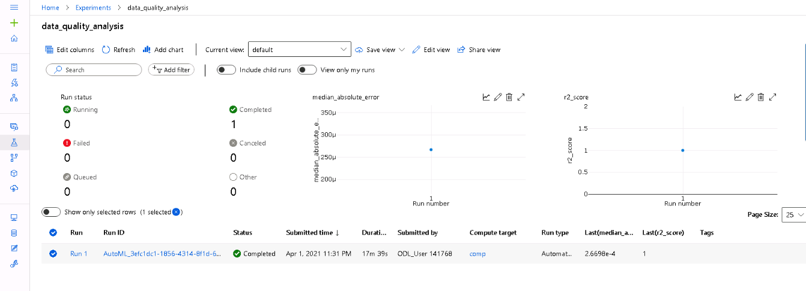
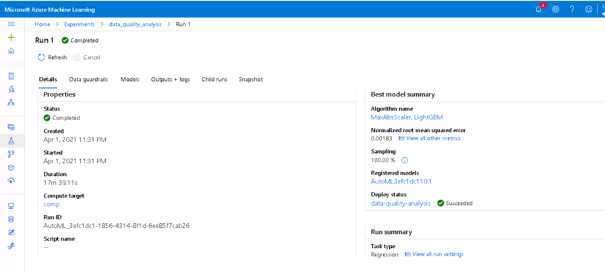
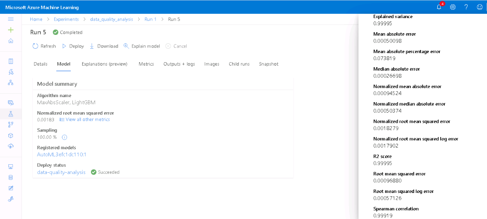
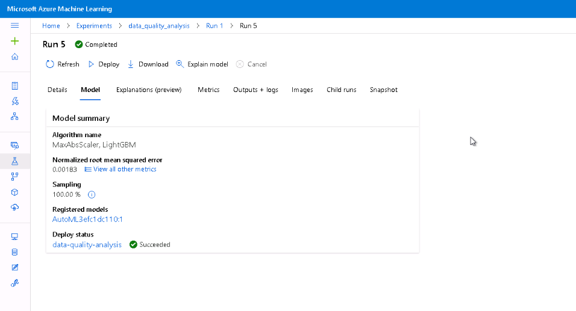
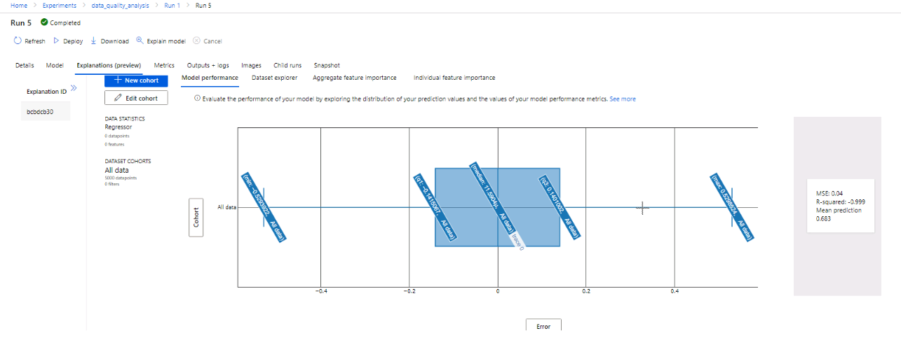
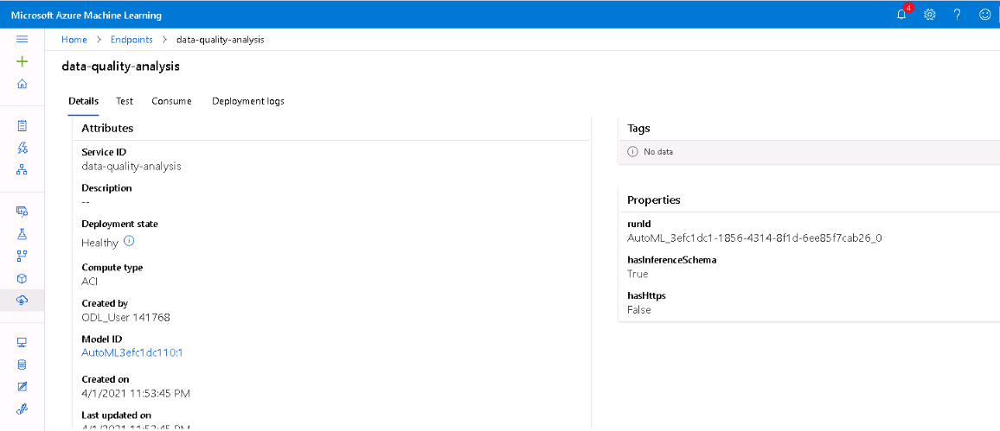
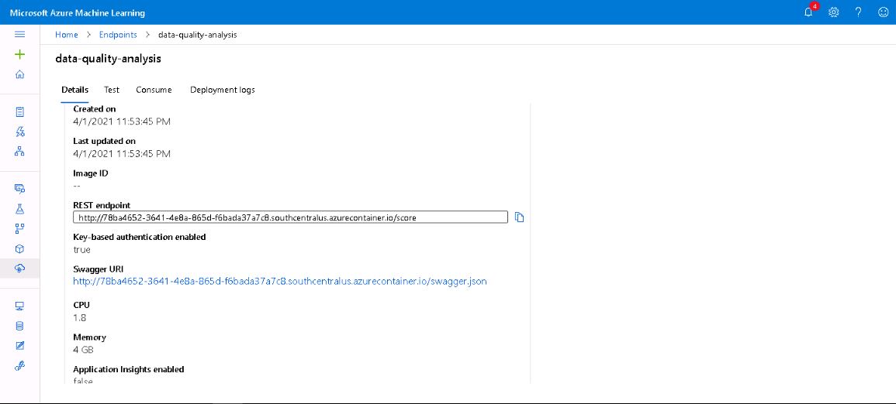

#  Machine Learning on Catalogue quality scores dataset in Azure

## Introduction
This project has been done for practice and learning purposes in order to better my understanding of Machine Learning in Azure. 
In this project, I have performed AutoML regression as well as linear regression in python to check the root mean squared error for the column 'score' and compare which one gives the best model.

## Installation
* The dataset used is about 'Catalogue quality scores' and has been obtained from [Toronto Open Dataset website](https://open.toronto.ca/dataset/catalogue-quality-scores/)
* Dependencies: [Code file link](https://github.com/shatakshipachori/data_quality_analysis.git)
* Usage: [Azure Machine Learning Studio](https://azure.microsoft.com/en-in/services/machine-learning/) Notebook

## Dataset
The Data Quality Score reflects, in the form of a Gold, Silver or Bronze badge, how valuable a dataset is based on a set of characteristics that increase its potential to be used for addressing civic issues such as how usable, timely, complete, and well-described it is. High quality data enables high quality impact.
This dataset contains the current and historic Data Quality Score results for the Open Data Toronto catalogue.

**Target column: score**- Summary of accessibility, completeness, freshness, metadata, and usability scores into a single score. Weights determined via rank weighting.

## Snapshots

#### AutoML Experiment

#### Best AutoML model

#### Best run metrics

#### Model Deployment

#### Model Performance

#### Model endpoint

## Youtube Video Link 
[Basic regression analysis using python in Azure](https://youtu.be/0KR0gucxt0A)

## License

MIT License

Copyright (c) 2021 Shatakshi Pachori
